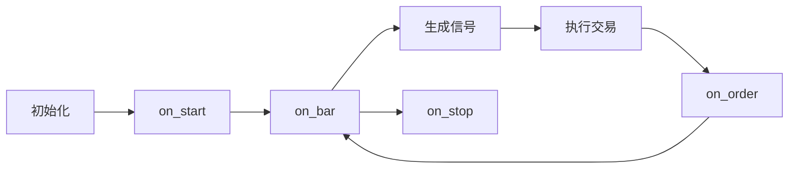

# 策略接口

策略接口是 OpenFinAgent 的核心，所有交易策略都基于此接口开发。

## 🎯 策略基类

### 基本结构

```python
from openfinagent import Strategy, Signal, SignalType

class MyStrategy(Strategy):
    """自定义策略"""
    
    def __init__(self, **params):
        """初始化策略"""
        super().__init__(name="MyStrategy")
        self.params = params
    
    def on_bar(self, bar):
        """处理每个 K 线"""
        pass
    
    def on_signal(self, signal):
        """处理信号"""
        pass
    
    def on_order(self, order):
        """处理订单状态更新"""
        pass
```

### 生命周期



## 📡 信号生成

### 信号类型

```python
from openfinagent import Signal, SignalType

# 买入信号
signal = Signal(
    type=SignalType.BUY,
    symbol='AAPL',
    strength=0.8,
    reason='金叉买入'
)

# 卖出信号
signal = Signal(
    type=SignalType.SELL,
    symbol='AAPL',
    strength=1.0,
    reason='死叉卖出'
)

# 发送信号
self.emit_signal(signal)
```

### 信号强度

| 强度 | 值范围 | 说明 |
|------|--------|------|
| 弱 | 0.3-0.5 | 轻微信号 |
| 中 | 0.5-0.7 | 中等信号 |
| 强 | 0.7-0.9 | 强烈信号 |
| 极强 | 0.9-1.0 | 极强信号 |

## 📊 数据访问

### 价格数据

```python
# 获取收盘价
closes = self.get_closes(count=100)

# 获取开盘价
opens = self.get_opens(count=100)

# 获取最高价
highs = self.get_highs(count=100)

# 获取最低价
lows = self.get_lows(count=100)

# 获取成交量
volumes = self.get_volumes(count=100)
```

### 当前状态

```python
# 当前价格
price = self.get_price()

# 当前 K 线
bar = self.get_current_bar()

# 当前时间
time = self.get_current_time()

# 当前持仓
position = self.get_position()
```

## 🎛️ 交易方法

### 基础交易

```python
# 买入
self.buy(quantity=100)
self.buy(value=10000)  # 按金额
self.buy(percent=0.5)  # 按仓位比例

# 卖出
self.sell(quantity=100)
self.sell(percent=0.5)

# 平仓
self.close_position()
```

### 条件交易

```python
# 设置止盈止损
self.set_stop_loss(price=100.0)
self.set_take_profit(price=120.0)

# 追踪止损
self.set_trailing_stop(percent=0.05)

# 条件单
self.add_condition_order(
    condition=lambda: self.get_price() > 110,
    action=lambda: self.sell()
)
```

## 📈 技术指标

### 内置指标

```python
# 移动平均
sma = self.sma(period=20)
ema = self.ema(period=20)

# MACD
macd_line, signal_line, hist = self.macd()

# RSI
rsi = self.rsi(period=14)

# 布林带
upper, middle, lower = self.bollinger_bands()

# ATR
atr = self.atr(period=14)
```

### 自定义指标

```python
def my_indicator(prices):
    """自定义指标"""
    return sum(prices[-10:]) / 10

result = self.apply_indicator(my_indicator)
```

## 🔧 策略配置

### 参数定义

```python
class MyStrategy(Strategy):
    # 策略参数
    params = {
        'short_window': 5,
        'long_window': 20,
        'stop_loss': 0.05
    }
    
    def __init__(self, **kwargs):
        super().__init__()
        # 更新参数
        self.params.update(kwargs)
```

### 配置文件

```yaml
strategy:
  name: MyStrategy
  params:
    short_window: 5
    long_window: 20
  risk:
    max_position: 10000
    stop_loss: 0.05
```

## 📊 回测集成

### 运行回测

```python
from openfinagent import Backtester, MyStrategy

strategy = MyStrategy(short_window=5, long_window=20)

backtester = Backtester(
    strategy=strategy,
    data_file='data.csv',
    initial_capital=100000,
    commission=0.001
)

results = backtester.run()
print(results.summary())
```

### 回测结果

```python
# 基本统计
print(results.total_return)      # 总收益率
print(results.annual_return)     # 年化收益率
print(results.max_drawdown)      # 最大回撤
print(results.sharpe_ratio)      # 夏普比率

# 交易统计
print(results.trade_count)       # 交易次数
print(results.win_rate)          # 胜率
print(results.profit_factor)     # 盈亏比

# 可视化
results.plot()
results.plot_equity_curve()
results.plot_drawdown()
```

## 📚 示例策略

```python
from openfinagent import Strategy, Signal, SignalType

class SimpleMAStrategy(Strategy):
    """简单均线策略示例"""
    
    def __init__(self, window=20):
        super().__init__(name="SimpleMA")
        self.window = window
    
    def on_bar(self, bar):
        closes = self.get_closes(self.window + 1)
        
        if len(closes) < self.window + 1:
            return
        
        # 计算均线
        ma = sum(closes[-self.window:]) / self.window
        current_price = closes[-1]
        
        # 生成信号
        if current_price > ma * 1.02 and not self.has_position():
            self.emit_signal(Signal(
                type=SignalType.BUY,
                strength=0.8
            ))
        elif current_price < ma * 0.98 and self.has_position():
            self.emit_signal(Signal(
                type=SignalType.SELL,
                strength=1.0
            ))
```

## 📚 相关文档

- [API 索引](index.md)
- [交易接口](trading.md)
- [数据接口](data.md)

---

_策略接口是量化交易的核心，请仔细阅读文档。_
