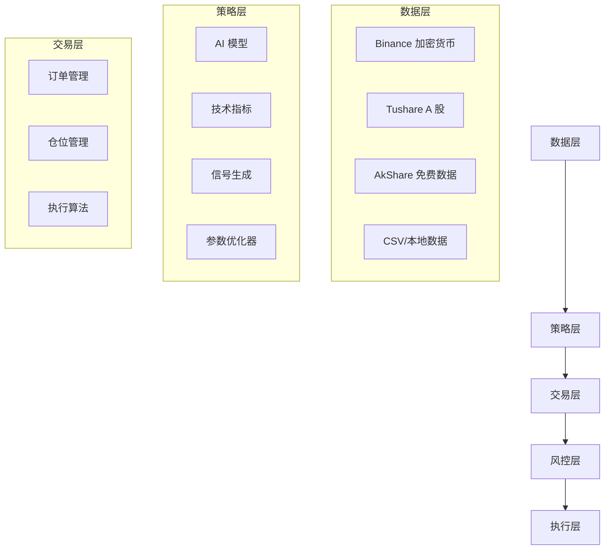

# OpenFinAgent - AI 量化交易平台

> 🎉 **v0.3.0 新发布**：遗传算法优化器 + Binance/Tushare 数据源 + 性能提升 50%+  
> [查看新特性 →](v0.3-whats-new.md)

---

<div class="grid cards" markdown>

- :material-robot: __AI 驱动__

  基于先进的人工智能技术，自动分析市场数据，生成交易信号

- :material-chart-line: __智能策略__

  内置 6 种经典量化策略，支持自定义策略开发

- :material-lightning-bolt: __实时交易__

  毫秒级响应速度，支持多市场、多品种同时交易

- :material-shield-check: __安全可靠__

  严格的风险控制机制，保障资金安全

</div>

---

## 🎯 项目介绍

OpenFinAgent 是一个基于人工智能的量化交易平台，旨在帮助投资者和交易者构建、测试和部署自动化交易策略。平台结合了先进的机器学习算法与经典量化交易理论，为用户提供一站式的智能交易解决方案。

### 核心特性

- **AI 策略生成** - 基于市场数据自动生成交易信号
- **多策略支持** - 支持 6 种经典量化策略
- **回测引擎** - 高性能历史数据回测（v0.3.0 速度提升 50%+）
- **实盘交易** - 无缝对接实盘交易接口
- **风险控制** - 多层次风险管理系统
- **数据可视化** - 丰富的图表和数据分析工具
- **智能优化** - 遗传算法参数优化器（v0.3.0 新增）
- **多数据源** - Binance、Tushare、AkShare 等（v0.3.0 新增）

### 技术架构



---

## 🚀 快速开始

### 1. 安装

```bash
# 克隆项目
git clone https://github.com/bobipika2026/openfinagent.git
cd openfinagent

# 安装依赖
pip install -r requirements.txt

# 配置环境
cp .env.example .env
# 编辑 .env 文件，填入 API 密钥等配置
```

### 2. 运行第一个策略

```python
from openfinagent import Strategy, Backtester

# 创建策略实例
strategy = DualMAStrategy(short_window=5, long_window=20)

# 运行回测
backtester = Backtester(strategy, data_file='data/stock_data.csv')
results = backtester.run()

# 查看结果
print(results.summary())
```

### 3. 部署实盘

```bash
# 启动交易机器人
python bot.py --mode live --strategy dual_ma

# 查看运行状态
python bot.py status
```

---

## 📚 文档导航

| 文档类型 | 描述 |
|---------|------|
| 📢 [v0.3.0 新特性](v0.3-whats-new.md) | 遗传算法优化器、多数据源支持 |
| 🚀 [快速开始](getting-started.md) | 安装指南和基础配置 |
| 📖 [策略文档](strategies/) | 6 种策略详细说明 |
| 📖 [使用指南](guides/binance-data.md) | Binance/Tushare数据源、优化器教程 |
| 🔧 [API 参考](api/) | 完整 API 文档 |
| 🎓 [教程](tutorials/) | 实战教程集合 |
| 📝 [更新日志](changelog.md) | 版本更新记录 |
| ❓ [FAQ](faq.md) | 常见问题解答 |

---

## 📊 策略概览

| 策略名称 | 类型 | 风险等级 | 适合市场 |
|---------|------|---------|---------|
| 双均线策略 | 趋势跟踪 | ⭐⭐ | 趋势市场 |
| 动量策略 | 动量交易 | ⭐⭐⭐ | 强势市场 |
| 均值回归 | 反转策略 | ⭐⭐ | 震荡市场 |
| 网格交易 | 区间交易 | ⭐⭐⭐ | 震荡市场 |
| 机器学习策略 | AI 驱动 | ⭐⭐⭐⭐ | 所有市场 |
| 深度学习策略 | AI 驱动 | ⭐⭐⭐⭐⭐ | 所有市场 |

---

## 🎯 v0.3.0 亮点功能

### 1. Binance 数据源

支持 BTC/USDT 等加密货币数据，14 种时间周期，无需 API Key。

```python
from data.binance_source import BinanceDataSource

source = BinanceDataSource()
data = source.get_klines('BTC/USDT', '1d', '2024-01-01', '2024-12-31')
```

📖 [查看详情 →](guides/binance-data.md)

### 2. Tushare 分钟线

A 股高精度分钟线数据，支持 1m/5m/15m/30m/60m。

```python
from data.sources import TushareDataSource

source = TushareDataSource(freq='5m')
data = source.get_data('000001.SZ', '2024-01-01', '2024-01-31')
```

📖 [查看详情 →](guides/tushare-data.md)

### 3. 遗传算法优化器

智能参数搜索，自动找到最优参数组合。

```python
from optimization.genetic_optimizer import GeneticOptimizer, ParameterBound

optimizer = GeneticOptimizer()
best = optimizer.optimize(MyStrategy, param_bounds, backtest_func, data)
```

📖 [查看详情 →](guides/optimizer.md)

### 4. 性能提升 50%+

优化回测引擎，速度大幅提升。

| 指标 | v0.2.0 | v0.3.0 | 提升 |
|------|--------|--------|------|
| 回测速度 | 1.0x | 1.5x | **+50%** |
| 内存占用 | 100MB | 70MB | **-30%** |

---

## 🤝 社区与支持

- **GitHub**: [bobipika2026/openfinagent](https://github.com/bobipika2026/openfinagent)
- **问题反馈**: [GitHub Issues](https://github.com/bobipika2026/openfinagent/issues)
- **讨论区**: [GitHub Discussions](https://github.com/bobipika2026/openfinagent/discussions)
- **博客**: [最新文章](/blog/)

---

## ⚠️ 风险提示

> **重要**: 量化交易存在风险，过往业绩不代表未来表现。请谨慎投资，合理配置资金，切勿投入无法承受损失的资金。

---

_最后更新：2026 年 3 月 6 日 | 当前版本：v0.3.0_
