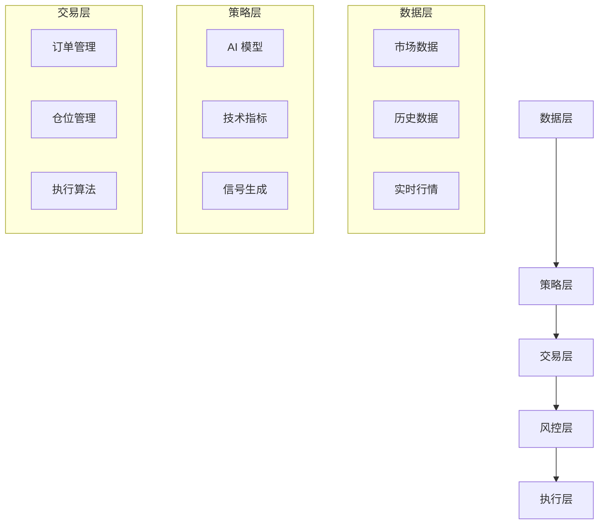

# OpenFinAgent - AI 量化交易平台

<div class="grid cards" markdown>

- :material-robot: __AI 驱动__

  基于先进的人工智能技术，自动分析市场数据，生成交易信号

- :material-chart-line: __智能策略__

  内置 6 种经典量化策略，支持自定义策略开发

- :material-lightning-bolt: __实时交易__

  毫秒级响应速度，支持多市场、多品种同时交易

- :material-shield-check: __安全可靠__

  严格的风险控制机制，保障资金安全

</div>

## 🎯 项目介绍

OpenFinAgent 是一个基于人工智能的量化交易平台，旨在帮助投资者和交易者构建、测试和部署自动化交易策略。平台结合了先进的机器学习算法与经典量化交易理论，为用户提供一站式的智能交易解决方案。

### 核心特性

- **AI 策略生成** - 基于市场数据自动生成交易信号
- **多策略支持** - 支持 6 种经典量化策略
- **回测引擎** - 高性能历史数据回测
- **实盘交易** - 无缝对接实盘交易接口
- **风险控制** - 多层次风险管理系统
- **数据可视化** - 丰富的图表和数据分析工具

### 技术架构



## 🚀 快速开始

### 1. 安装

```bash
# 克隆项目
git clone https://github.com/bobipika2026/openfinagent.git
cd openfinagent

# 安装依赖
pip install -r requirements.txt

# 配置环境
cp .env.example .env
# 编辑 .env 文件，填入 API 密钥等配置
```

### 2. 运行第一个策略

```python
from openfinagent import Strategy, Backtester

# 创建策略实例
strategy = DualMAStrategy(short_window=5, long_window=20)

# 运行回测
backtester = Backtester(strategy, data_file='data/stock_data.csv')
results = backtester.run()

# 查看结果
print(results.summary())
```

### 3. 部署实盘

```bash
# 启动交易机器人
python bot.py --mode live --strategy dual_ma

# 查看运行状态
python bot.py status
```

## 📚 文档导航

| 文档类型 | 描述 |
|---------|------|
| [快速开始](getting-started.md) | 安装指南和基础配置 |
| [策略文档](strategies/) | 6 种策略详细说明 |
| [API 参考](api/) | 完整 API 文档 |
| [教程](tutorials/) | 实战教程集合 |
| [FAQ](faq.md) | 常见问题解答 |

## 📊 策略概览

| 策略名称 | 类型 | 风险等级 | 适合市场 |
|---------|------|---------|---------|
| 双均线策略 | 趋势跟踪 | ⭐⭐ | 趋势市场 |
| 动量策略 | 动量交易 | ⭐⭐⭐ | 强势市场 |
| 均值回归 | 反转策略 | ⭐⭐ | 震荡市场 |
| 网格交易 | 区间交易 | ⭐⭐⭐ | 震荡市场 |
| 机器学习策略 | AI 驱动 | ⭐⭐⭐⭐ | 所有市场 |
| 深度学习策略 | AI 驱动 | ⭐⭐⭐⭐⭐ | 所有市场 |

## 🤝 社区与支持

- **GitHub**: [bobipika2026/openfinagent](https://github.com/bobipika2026/openfinagent)
- **问题反馈**: [GitHub Issues](https://github.com/bobipika2026/openfinagent/issues)
- **讨论区**: [GitHub Discussions](https://github.com/bobipika2026/openfinagent/discussions)

## ⚠️ 风险提示

> **重要**: 量化交易存在风险，过往业绩不代表未来表现。请谨慎投资，合理配置资金，切勿投入无法承受损失的资金。

---

_最后更新：2026 年 3 月_
