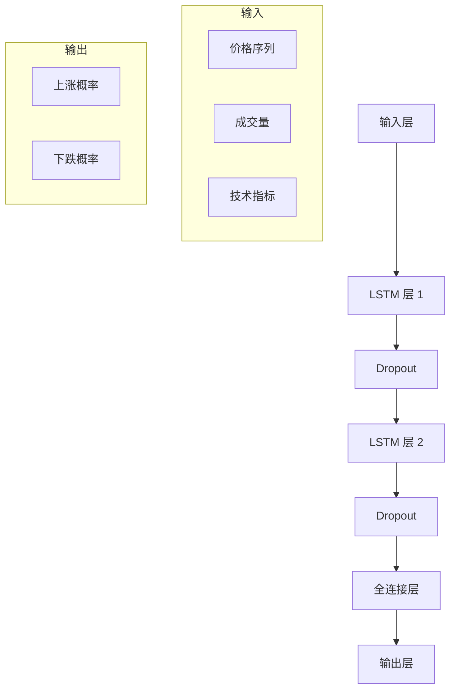

# 深度学习策略

深度学习策略（Deep Learning Strategy）利用深度神经网络分析复杂的市场模式，是量化交易的前沿技术。

## 📖 策略原理

### 核心思想

- **端到端学习**: 从原始数据直接学习交易信号
- **自动特征**: 神经网络自动提取有效特征
- **时序建模**: 捕捉时间序列中的复杂模式

### 常用模型

```
- LSTM (长短期记忆网络)
- GRU (门控循环单元)
- CNN (卷积神经网络)
- Transformer (注意力机制)
```

## 📊 模型架构



## 💻 代码实现

```python
from openfinagent import Strategy, Signal, SignalType
import numpy as np

try:
    import tensorflow as tf
    from tensorflow.keras.models import Sequential
    from tensorflow.keras.layers import LSTM, Dense, Dropout
    TF_AVAILABLE = True
except ImportError:
    TF_AVAILABLE = False

class DeepLearningStrategy(Strategy):
    """
    深度学习策略
    
    参数:
        sequence_length: 序列长度 (默认：60)
        lstm_units: LSTM 单元数 (默认：50)
        retrain_freq: 重新训练频率 (默认：10)
    """
    
    def __init__(self, sequence_length: int = 60,
                 lstm_units: int = 50,
                 retrain_freq: int = 10):
        super().__init__(name="DeepLearning")
        
        if not TF_AVAILABLE:
            raise ImportError("请安装 TensorFlow: pip install tensorflow")
        
        self.sequence_length = sequence_length
        self.lstm_units = lstm_units
        self.retrain_freq = retrain_freq
        
        self.model = None
        self.is_trained = False
        self.train_count = 0
        
        self._build_model()
    
    def _build_model(self):
        """构建 LSTM 模型"""
        model = Sequential([
            LSTM(self.lstm_units, 
                 return_sequences=True,
                 input_shape=(self.sequence_length, 5)),
            Dropout(0.2),
            LSTM(self.lstm_units // 2),
            Dropout(0.2),
            Dense(32, activation='relu'),
            Dense(1, activation='sigmoid')
        ])
        
        model.compile(
            optimizer='adam',
            loss='binary_crossentropy',
            metrics=['accuracy']
        )
        
        self.model = model
    
    def create_sequences(self, data, labels):
        """创建序列数据"""
        X, y = [], []
        for i in range(len(data) - self.sequence_length):
            X.append(data[i:i + self.sequence_length])
            y.append(labels[i + self.sequence_length])
        return np.array(X), np.array(y)
    
    def prepare_features(self, prices, volumes=None):
        """准备特征"""
        n = len(prices)
        features = np.zeros((n, 5))
        
        # 归一化价格
        features[:, 0] = prices / prices[0]
        
        # 收益率
        features[1:, 1] = np.diff(prices) / prices[:-1]
        
        # 波动率
        for i in range(10, n):
            features[i, 2] = np.std(prices[i-10:i]) / np.mean(prices[i-10:i])
        
        # 均线偏离
        for i in range(20, n):
            ma = np.mean(prices[i-20:i])
            features[i, 3] = (prices[i] - ma) / ma
        
        # 成交量变化率
        if volumes is not None:
            features[1:, 4] = np.diff(volumes) / volumes[:-1]
        
        return features
    
    def train_model(self, prices):
        """训练模型"""
        # 准备数据
        features = self.prepare_features(prices)
        
        # 创建标签（未来 5 日涨跌）
        labels = np.zeros(len(prices))
        for i in range(len(prices) - 5):
            labels[i] = 1 if prices[i + 5] > prices[i] else 0
        
        # 创建序列
        X, y = self.create_sequences(features, labels)
        
        if len(X) > 100:
            # 训练模型
            self.model.fit(
                X, y,
                epochs=20,
                batch_size=32,
                validation_split=0.2,
                verbose=0
            )
            self.is_trained = True
    
    def on_bar(self, bar):
        self.train_count += 1
        
        # 定期重新训练
        if self.train_count % self.retrain_freq == 0:
            prices = self.get_closes(500)
            if len(prices) > 200:
                self.train_model(prices)
        
        if not self.is_trained:
            return
        
        # 获取当前数据
        prices = self.get_closes(self.sequence_length + 10)
        if len(prices) < self.sequence_length:
            return
        
        # 准备特征
        features = self.prepare_features(prices)
        X = features[-self.sequence_length:].reshape(1, self.sequence_length, 5)
        
        # 预测
        prob = self.model.predict(X, verbose=0)[0][0]
        
        # 生成信号
        if prob > 0.6:
            self.emit_signal(Signal(
                type=SignalType.BUY,
                strength=prob,
                reason=f"DL 预测上涨 (概率{prob:.2%})"
            ))
        elif prob < 0.4:
            self.emit_signal(Signal(
                type=SignalType.SELL,
                strength=1 - prob,
                reason=f"DL 预测下跌 (概率{1-prob:.2%})"
            ))
```

## ⚙️ 参数配置

```yaml
strategy:
  name: DeepLearning
  params:
    sequence_length: 60   # 序列长度
    lstm_units: 50        # LSTM 单元数
    dropout_rate: 0.2     # Dropout 比例
    retrain_freq: 10      # 重新训练频率
    epochs: 20            # 训练轮数
    batch_size: 32        # 批次大小
```

### 模型架构选择

| 模型类型 | 适用场景 | 复杂度 |
|---------|---------|--------|
| LSTM | 时序预测 | ⭐⭐⭐⭐ |
| GRU | 时序预测（更快） | ⭐⭐⭐ |
| CNN | 模式识别 | ⭐⭐⭐ |
| Transformer | 长期依赖 | ⭐⭐⭐⭐⭐ |

## 📈 回测示例

```python
from openfinagent import Backtester, DeepLearningStrategy

# 创建策略
strategy = DeepLearningStrategy(
    sequence_length=60,
    lstm_units=50,
    retrain_freq=10
)

# 配置回测
backtester = Backtester(
    strategy=strategy,
    data_file='data/stock_data.csv',
    initial_capital=100000,
    commission=0.001
)

# 运行回测
results = backtester.run()

# 输出结果
print(f"总收益率：{results.total_return:.2%}")
print(f"夏普比率：{results.sharpe_ratio:.2f}")
print(f"最大回撤：{results.max_drawdown:.2%}")
print(f"预测准确率：{results.accuracy:.2%}")
```

## 🎯 优缺点分析

### 优点

- ✅ 自动学习复杂模式
- ✅ 处理高维数据
- ✅ 端到端训练
- ✅ 适应性强

### 缺点

- ❌ 需要大量数据
- ❌ 训练时间长
- ❌ 计算资源需求高
- ❌ 模型解释性差

## 🔧 优化方向

### 1. 注意力机制

```python
from tensorflow.keras.layers import Attention

# 添加注意力层
model = Sequential([
    LSTM(50, return_sequences=True),
    Attention(),
    Dense(1, activation='sigmoid')
])
```

### 2. 多模型集成

```python
# 多个模型投票
models = [create_lstm(), create_gru(), create_cnn()]
predictions = [m.predict(X) for m in models]
final_pred = np.mean(predictions, axis=0)
```

### 3. 迁移学习

```python
# 使用预训练模型
base_model = create_lstm()
base_model.load_weights('pretrained_weights.h5')

# 微调最后几层
for layer in base_model.layers[:-2]:
    layer.trainable = False

base_model.compile(optimizer='adam', loss='binary_crossentropy')
```

## 📊 适用场景

| 场景 | 适用性 | 说明 |
|------|--------|------|
| 高频交易 | ⭐⭐⭐⭐ | 模式识别强 |
| 股票市场 | ⭐⭐⭐⭐ | 数据充足 |
| 期货市场 | ⭐⭐⭐⭐ | 规律性强 |
| 加密货币 | ⭐⭐⭐⭐⭐ | 数据量大 |

## ⚠️ 风险提示

1. **过拟合**: 模型过度拟合训练数据
2. **计算成本**: GPU 资源需求高
3. **黑箱风险**: 决策过程不透明
4. **数据质量**: 依赖高质量数据

## 📚 相关资源

- [策略文档索引](index.md)
- [深度学习教程](../tutorials/)
- [模型部署](../api/deployment.md)

---

_深度学习代表了量化交易的最高技术水平。_
