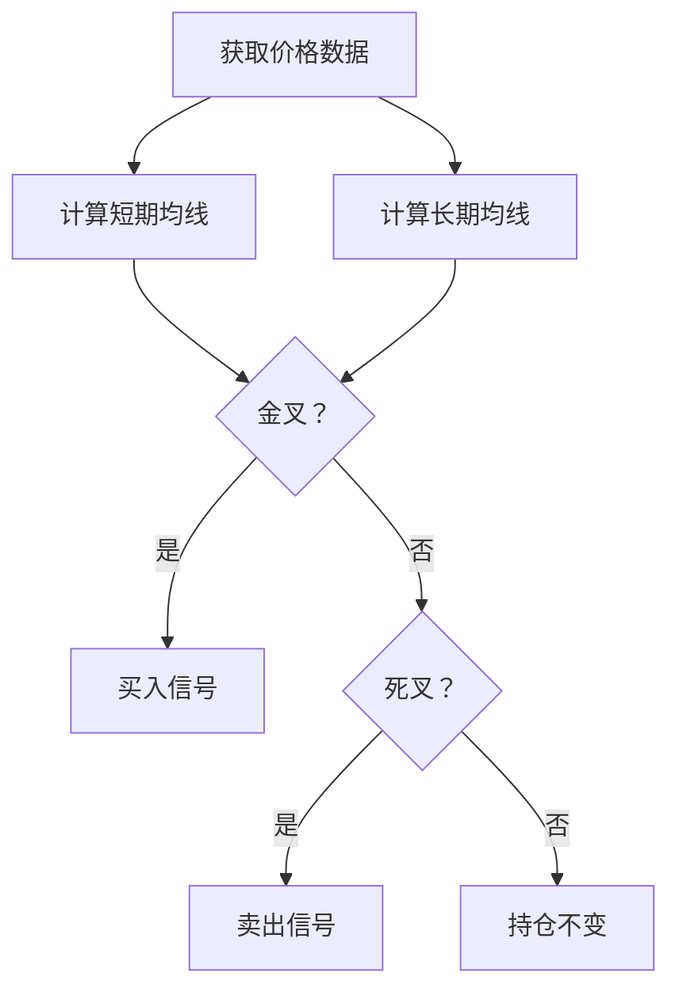

# 双均线策略

双均线策略（Dual Moving Average）是一种经典的趋势跟踪策略，通过短期均线和长期均线的交叉来生成交易信号。

## 📖 策略原理

### 核心思想

- **金叉买入**: 当短期均线上穿长期均线时，产生买入信号
- **死叉卖出**: 当短期均线下穿长期均线时，产生卖出信号

### 技术指标

```
短期均线 (SMA_short): 5-20 日
长期均线 (SMA_long): 20-60 日
```

## 📊 策略图示



## 💻 代码实现

```python
from openfinagent import Strategy, Signal, SignalType

class DualMAStrategy(Strategy):
    """
    双均线策略
    
    参数:
        short_window: 短期均线周期 (默认：5)
        long_window: 长期均线周期 (默认：20)
    """
    
    def __init__(self, short_window: int = 5, long_window: int = 20):
        super().__init__(name="DualMA")
        self.short_window = short_window
        self.long_window = long_window
        self.short_ma = None
        self.long_ma = None
    
    def on_bar(self, bar):
        # 获取历史收盘价
        closes = self.get_closes(self.long_window + 1)
        
        if len(closes) < self.long_window + 1:
            return
        
        # 计算均线
        prev_short_ma = sum(closes[-self.short_window-1:-1]) / self.short_window
        prev_long_ma = sum(closes[-self.long_window-1:-1]) / self.long_window
        curr_short_ma = sum(closes[-self.short_window:]) / self.short_window
        curr_long_ma = sum(closes[-self.long_window:]) / self.long_window
        
        # 检测金叉
        if prev_short_ma <= prev_long_ma and curr_short_ma > curr_long_ma:
            self.emit_signal(Signal(
                type=SignalType.BUY,
                strength=0.8,
                reason="金叉买入"
            ))
        
        # 检测死叉
        elif prev_short_ma >= prev_long_ma and curr_short_ma < curr_long_ma:
            self.emit_signal(Signal(
                type=SignalType.SELL,
                strength=0.8,
                reason="死叉卖出"
            ))
```

## ⚙️ 参数配置

```yaml
strategy:
  name: DualMA
  params:
    short_window: 5      # 短期均线周期
    long_window: 20      # 长期均线周期
    stop_loss: 0.05      # 止损比例
    take_profit: 0.10    # 止盈比例
```

### 参数调优建议

| 市场类型 | short_window | long_window |
|---------|-------------|-------------|
| 短线交易 | 5 | 20 |
| 中线交易 | 10 | 30 |
| 长线交易 | 20 | 60 |

## 📈 回测示例

```python
from openfinagent import Backtester, DualMAStrategy

# 创建策略
strategy = DualMAStrategy(short_window=5, long_window=20)

# 配置回测
backtester = Backtester(
    strategy=strategy,
    data_file='data/stock_data.csv',
    initial_capital=100000,
    commission=0.001,
    start_date='2023-01-01',
    end_date='2023-12-31'
)

# 运行回测
results = backtester.run()

# 输出结果
print(results.summary())
print(f"总收益率：{results.total_return:.2%}")
print(f"最大回撤：{results.max_drawdown:.2%}")
print(f"夏普比率：{results.sharpe_ratio:.2f}")

# 绘制资金曲线
results.plot()
```

## 🎯 优缺点分析

### 优点

- ✅ 逻辑简单，易于理解和实现
- ✅ 在趋势明显的市场中表现优异
- ✅ 参数少，易于调优
- ✅ 交易信号明确，执行方便

### 缺点

- ❌ 在震荡市场中容易产生假信号
- ❌ 存在滞后性，可能错过最佳买卖点
- ❌ 需要较大的趋势才能获利
- ❌ 频繁交易可能导致手续费过高

## 🔧 优化方向

### 1. 添加过滤器

```python
# 添加成交量过滤
if volume > self.get_avg_volume(20) * 1.5:
    # 确认信号有效
    pass

# 添加波动率过滤
if volatility < threshold:
    # 市场过于平静，不交易
    return
```

### 2. 多周期共振

```python
# 同时检查日线、周线趋势
daily_trend = self.get_daily_trend()
weekly_trend = self.get_weekly_trend()

if daily_trend == weekly_trend == 'up':
    # 多周期共振，信号更强
    pass
```

### 3. 动态参数调整

```python
# 根据市场波动率动态调整均线周期
if market_volatility > high_threshold:
    self.short_window = 10
    self.long_window = 30
else:
    self.short_window = 5
    self.long_window = 20
```

## 📊 适用场景

| 场景 | 适用性 | 说明 |
|------|--------|------|
| 股票趋势行情 | ⭐⭐⭐⭐ | 适合单边上涨或下跌 |
| 期货趋势行情 | ⭐⭐⭐⭐⭐ | 期货趋势性强，效果好 |
| 外汇市场 | ⭐⭐⭐ | 需要结合其他指标 |
| 加密货币 | ⭐⭐⭐⭐ | 波动大，趋势明显 |
| 震荡市场 | ⭐⭐ | 容易产生假信号 |

## ⚠️ 风险提示

1. **滞后风险**: 均线指标具有滞后性
2. **震荡风险**: 震荡市场频繁止损
3. **参数风险**: 参数过拟合历史数据
4. **执行风险**: 实际成交可能与信号有偏差

## 📚 相关资源

- [策略文档索引](index.md)
- [回测教程](../tutorials/backtesting.md)
- [API 参考](../api/strategy.md)

---

_双均线策略是量化交易的入门策略，适合初学者学习和实践。_
