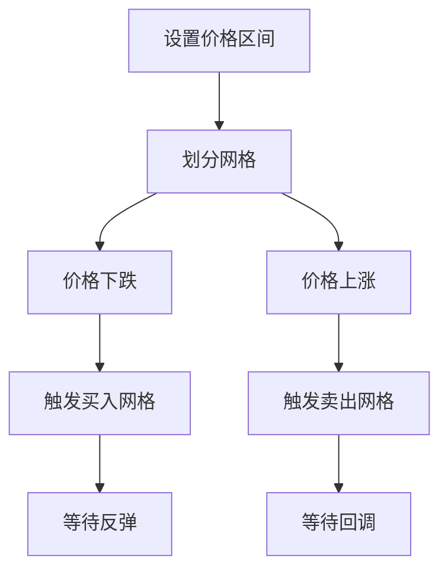

# 网格交易策略

网格交易策略（Grid Trading Strategy）是一种在预设价格区间内分批买入卖出的量化策略，适合震荡市场。

## 📖 策略原理

### 核心思想

- **区间交易**: 在预设的价格区间内设置多个网格
- **低买高卖**: 价格下跌时买入，上涨时卖出
- **分批操作**: 每次只交易一部分仓位

### 网格设置

```
价格区间：[最低价，最高价]
网格数量：N
网格间距：(最高价 - 最低价) / N

每个网格触发一次买卖
```

## 📊 策略图示



## 💻 代码实现

```python
from openfinagent import Strategy, Signal, SignalType
import numpy as np

class GridTradingStrategy(Strategy):
    """
    网格交易策略
    
    参数:
        min_price: 最低价格 (默认：100)
        max_price: 最高价格 (默认：200)
        grid_num: 网格数量 (默认：10)
        base_quantity: 每格交易数量 (默认：100)
    """
    
    def __init__(self, min_price: float = 100,
                 max_price: float = 200,
                 grid_num: int = 10,
                 base_quantity: int = 100):
        super().__init__(name="GridTrading")
        self.min_price = min_price
        self.max_price = max_price
        self.grid_num = grid_num
        self.base_quantity = base_quantity
        
        # 计算网格
        self.grid_step = (max_price - min_price) / grid_num
        self.grid_levels = [
            min_price + i * self.grid_step 
            for i in range(grid_num + 1)
        ]
        
        # 记录网格状态
        self.grid_positions = {i: 0 for i in range(grid_num)}
    
    def get_grid_level(self, price):
        """获取当前价格所在的网格级别"""
        for i in range(self.grid_num):
            if self.grid_levels[i] <= price < self.grid_levels[i + 1]:
                return i
        return -1
    
    def on_bar(self, bar):
        current_price = bar.close
        grid_level = self.get_grid_level(current_price)
        
        if grid_level < 0:
            # 价格超出网格范围
            return
        
        # 检查是否需要买入（价格下跌到下一格）
        if grid_level > 0:
            prev_level = grid_level - 1
            if self.grid_positions[prev_level] == 0:
                self.emit_signal(Signal(
                    type=SignalType.BUY,
                    quantity=self.base_quantity,
                    strength=0.6,
                    reason=f"网格买入 (级别{grid_level})"
                ))
                self.grid_positions[prev_level] = 1
        
        # 检查是否需要卖出（价格上涨到上一格）
        if grid_level < self.grid_num - 1:
            next_level = grid_level + 1
            if self.grid_positions[next_level] == 1:
                self.emit_signal(Signal(
                    type=SignalType.SELL,
                    quantity=self.base_quantity,
                    strength=0.6,
                    reason=f"网格卖出 (级别{grid_level})"
                ))
                self.grid_positions[next_level] = 0
```

## ⚙️ 参数配置

```yaml
strategy:
  name: GridTrading
  params:
    min_price: 100        # 最低价格
    max_price: 200        # 最高价格
    grid_num: 10          # 网格数量
    base_quantity: 100    # 每格交易数量
    max_position: 1000    # 最大仓位
```

### 参数调优建议

| 市场类型 | grid_num | grid_step | 说明 |
|---------|----------|-----------|------|
| 高波动 | 5 | 大 | 减少交易频率 |
| 中波动 | 10 | 中 | 平衡收益和风险 |
| 低波动 | 20 | 小 | 增加交易频率 |

## 📈 回测示例

```python
from openfinagent import Backtester, GridTradingStrategy

# 创建策略
strategy = GridTradingStrategy(
    min_price=100,
    max_price=200,
    grid_num=10,
    base_quantity=100
)

# 配置回测
backtester = Backtester(
    strategy=strategy,
    data_file='data/stock_data.csv',
    initial_capital=100000,
    commission=0.001
)

# 运行回测
results = backtester.run()

# 输出结果
print(f"总收益率：{results.total_return:.2%}")
print(f"交易次数：{results.trade_count}")
print(f"胜率：{results.win_rate:.2%}")
print(f"网格收益：{results.grid_profit:.2f}")
```

## 🎯 优缺点分析

### 优点

- ✅ 震荡市场稳定盈利
- ✅ 自动化交易，无需预测方向
- ✅ 风险分散，分批建仓
- ✅ 适合程序化执行

### 缺点

- ❌ 趋势市场可能亏损
- ❌ 需要预设价格区间
- ❌ 资金利用率较低
- ❌ 突破区间后被动

## 🔧 优化方向

### 1. 动态网格调整

```python
# 根据波动率动态调整网格
volatility = self.get_volatility(20)

if volatility > high_threshold:
    # 扩大网格间距
    self.grid_step = self.grid_step * 1.5
elif volatility < low_threshold:
    # 缩小网格间距
    self.grid_step = self.grid_step * 0.8
```

### 2. 趋势过滤

```python
# 结合趋势指标
trend = self.get_trend_indicator()

if trend == 'strong_up':
    # 只执行买入网格
    self.execute_buy_grids()
elif trend == 'strong_down':
    # 只执行卖出网格
    self.execute_sell_grids()
else:
    # 正常网格交易
    self.execute_normal_grid()
```

### 3. 移动网格

```python
# 网格跟随价格移动
current_price = bar.close
center_price = (self.min_price + self.max_price) / 2

if current_price > center_price * 1.1:
    # 向上移动网格
    self.shift_grid(up=True)
elif current_price < center_price * 0.9:
    # 向下移动网格
    self.shift_grid(up=False)
```

## 📊 适用场景

| 场景 | 适用性 | 说明 |
|------|--------|------|
| 震荡市场 | ⭐⭐⭐⭐⭐ | 最佳场景 |
| 箱体震荡 | ⭐⭐⭐⭐⭐ | 完美匹配 |
| 温和趋势 | ⭐⭐⭐ | 需要调整 |
| 强趋势 | ⭐ | 风险大 |
| 加密货币 | ⭐⭐⭐⭐ | 波动大适合 |

## ⚠️ 风险提示

1. **突破风险**: 价格突破区间后被动
2. **趋势风险**: 单边趋势持续亏损
3. **资金风险**: 需要充足资金应对
4. **流动性风险**: 极端行情难以成交

## 📚 相关资源

- [策略文档索引](index.md)
- [震荡市场识别](../tutorials/)
- [资金管理](../api/risk.md)

---

_网格交易是震荡市场的"印钞机"，但需要严格的风险控制。_
