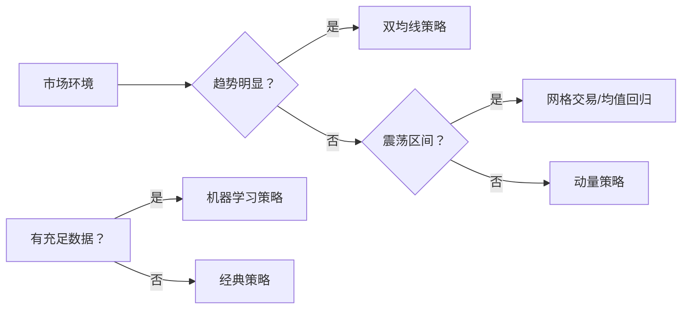

# 策略文档

OpenFinAgent 内置了 6 种经典量化交易策略，涵盖趋势跟踪、动量交易、均值回归等多种交易理念。

## 📊 策略列表

| 策略 | 类型 | 复杂度 | 风险等级 | 适合市场 |
|------|------|--------|---------|---------|
| [双均线策略](dual-ma.md) | 趋势跟踪 | ⭐⭐ | ⭐⭐ | 趋势市场 |
| [动量策略](momentum.md) | 动量交易 | ⭐⭐⭐ | ⭐⭐⭐ | 强势市场 |
| [均值回归策略](mean-reversion.md) | 反转策略 | ⭐⭐ | ⭐⭐ | 震荡市场 |
| [网格交易策略](grid-trading.md) | 区间交易 | ⭐⭐⭐ | ⭐⭐⭐ | 震荡市场 |
| [机器学习策略](ml-strategy.md) | AI 驱动 | ⭐⭐⭐⭐ | ⭐⭐⭐⭐ | 所有市场 |
| [深度学习策略](deep-learning.md) | AI 驱动 | ⭐⭐⭐⭐⭐ | ⭐⭐⭐⭐⭐ | 所有市场 |

## 🎯 策略选择指南

### 根据市场环境选择



### 根据风险偏好选择

- **保守型**: 双均线策略、均值回归策略
- **平衡型**: 动量策略、网格交易策略
- **进取型**: 机器学习策略、深度学习策略

## 🔧 策略通用接口

所有策略都继承自统一的 `Strategy` 基类：

```python
from openfinagent import Strategy, Signal, SignalType

class MyStrategy(Strategy):
    def __init__(self, **params):
        super().__init__(name="MyStrategy")
        # 初始化参数
    
    def on_bar(self, bar):
        """处理每个 K 线"""
        # 策略逻辑
        pass
    
    def on_signal(self, signal):
        """处理信号"""
        pass
```

## 📈 策略评估指标

- **收益率**: 总收益率、年化收益率
- **风险指标**: 最大回撤、波动率、夏普比率
- **交易统计**: 胜率、盈亏比、交易次数
- **其他指标**: 索提诺比率、卡尔玛比率

## 🚀 自定义策略

```python
from openfinagent import Strategy

class CustomStrategy(Strategy):
    """自定义策略模板"""
    
    def __init__(self, param1=10, param2=20):
        super().__init__(name="CustomStrategy")
        self.param1 = param1
        self.param2 = param2
    
    def on_bar(self, bar):
        # 1. 获取数据
        closes = self.get_closes(self.param2)
        
        # 2. 计算指标
        indicator = self.calculate_indicator(closes)
        
        # 3. 生成信号
        if self.should_buy(indicator):
            self.buy()
        elif self.should_sell(indicator):
            self.sell()
```

## 📚 相关文档

- [API 参考 - 策略接口](../api/strategy.md)
- [教程 - 第一个策略](../tutorials/first-strategy.md)
- [教程 - 回测实战](../tutorials/backtesting.md)

---

_选择适合你的策略，开始量化交易之旅！_
