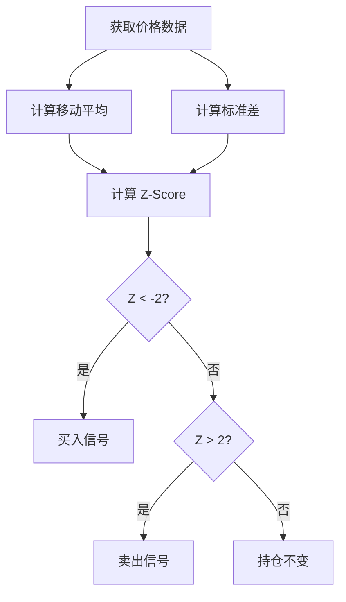

# 均值回归策略

均值回归策略（Mean Reversion Strategy）基于"价格围绕价值波动"的理念，当价格偏离均值时，预期会回归均值。

## 📖 策略原理

### 核心思想

- **价格回归**: 价格偏离均值过大时，会向均值回归
- **低买高卖**: 低于均值时买入，高于均值时卖出

### 统计基础

```
Z-Score = (当前价格 - 移动平均) / 标准差

当 Z-Score < -2: 价格过低，买入
当 Z-Score > 2: 价格过高，卖出
```

## 📊 策略图示



## 💻 代码实现

```python
from openfinagent import Strategy, Signal, SignalType
import numpy as np

class MeanReversionStrategy(Strategy):
    """
    均值回归策略
    
    参数:
        window: 移动平均窗口 (默认：20)
        entry_z: 开仓 Z 分数阈值 (默认：2.0)
        exit_z: 平仓 Z 分数阈值 (默认：0.5)
    """
    
    def __init__(self, window: int = 20, 
                 entry_z: float = 2.0,
                 exit_z: float = 0.5):
        super().__init__(name="MeanReversion")
        self.window = window
        self.entry_z = entry_z
        self.exit_z = exit_z
    
    def calculate_z_score(self, prices):
        """计算 Z 分数"""
        mean = np.mean(prices)
        std = np.std(prices)
        current_price = prices[-1]
        
        if std == 0:
            return 0
        
        return (current_price - mean) / std
    
    def on_bar(self, bar):
        # 获取历史价格
        closes = self.get_closes(self.window + 1)
        
        if len(closes) < self.window:
            return
        
        # 计算 Z 分数
        z_score = self.calculate_z_score(closes[-self.window:])
        
        # 检查是否持仓
        if self.has_position():
            # 持仓时，Z 分数回归到阈值内平仓
            if abs(z_score) < self.exit_z:
                self.emit_signal(Signal(
                    type=SignalType.SELL,
                    strength=1.0,
                    reason="均值回归平仓"
                ))
        else:
            # 未持仓时，Z 分数超出阈值开仓
            if z_score < -self.entry_z:
                self.emit_signal(Signal(
                    type=SignalType.BUY,
                    strength=0.8,
                    reason=f"价格过低 (Z={z_score:.2f})"
                ))
            elif z_score > self.entry_z:
                self.emit_signal(Signal(
                    type=SignalType.SELL,
                    strength=0.8,
                    reason=f"价格过高 (Z={z_score:.2f})"
                ))
```

## ⚙️ 参数配置

```yaml
strategy:
  name: MeanReversion
  params:
    window: 20          # 移动平均窗口
    entry_z: 2.0        # 开仓阈值
    exit_z: 0.5         # 平仓阈值
    stop_loss: 0.08     # 止损比例
```

### 参数调优建议

| 市场类型 | window | entry_z | exit_z |
|---------|--------|---------|--------|
| 高波动 | 30 | 2.5 | 0.8 |
| 中波动 | 20 | 2.0 | 0.5 |
| 低波动 | 15 | 1.5 | 0.3 |

## 📈 回测示例

```python
from openfinagent import Backtester, MeanReversionStrategy

# 创建策略
strategy = MeanReversionStrategy(
    window=20,
    entry_z=2.0,
    exit_z=0.5
)

# 配置回测
backtester = Backtester(
    strategy=strategy,
    data_file='data/stock_data.csv',
    initial_capital=100000,
    commission=0.001
)

# 运行回测
results = backtester.run()

# 输出结果
print(f"总收益率：{results.total_return:.2%}")
print(f"最大回撤：{results.max_drawdown:.2%}")
print(f"夏普比率：{results.sharpe_ratio:.2f}")
print(f"胜率：{results.win_rate:.2%}")

# 绘制结果
results.plot()
```

## 🎯 优缺点分析

### 优点

- ✅ 在震荡市场中表现优异
- ✅ 逻辑清晰，基于统计学原理
- ✅ 交易频率适中
- ✅ 风险控制相对容易

### 缺点

- ❌ 在趋势市场中表现差
- ❌ 可能出现"均值漂移"
- ❌ 需要判断市场状态
- ❌ 极端行情可能爆仓

## 🔧 优化方向

### 1. 动态阈值调整

```python
# 根据市场波动率动态调整阈值
volatility = self.get_volatility(20)

if volatility > high_vol_threshold:
    self.entry_z = 2.5
    self.exit_z = 0.8
elif volatility < low_vol_threshold:
    self.entry_z = 1.5
    self.exit_z = 0.3
```

### 2. 结合趋势过滤

```python
# 只在震荡市中交易
trend_strength = self.get_trend_strength()

if trend_strength < threshold:
    # 震荡市，执行均值回归
    self.execute_mean_reversion()
else:
    # 趋势市，不交易或切换策略
    pass
```

### 3. 多周期共振

```python
# 同时检查多个周期的 Z 分数
z_daily = self.calculate_z_score(daily_prices)
z_weekly = self.calculate_z_score(weekly_prices)

if z_daily < -2 and z_weekly < -1:
    # 多周期共振，信号更强
    self.buy()
```

## 📊 适用场景

| 场景 | 适用性 | 说明 |
|------|--------|------|
| 震荡市场 | ⭐⭐⭐⭐⭐ | 最佳适用场景 |
| 区间震荡股 | ⭐⭐⭐⭐ | 适合箱体震荡 |
| 趋势市场 | ⭐⭐ | 容易亏损 |
| 突破行情 | ⭐ | 风险极大 |

## ⚠️ 风险提示

1. **趋势风险**: 强趋势下持续亏损
2. **均值漂移**: 基本面变化导致均值移动
3. **黑天鹅**: 极端行情突破止损
4. **流动性**: 小盘股可能难以平仓

## 📚 相关资源

- [策略文档索引](index.md)
- [震荡市场识别教程](../tutorials/)
- [风险管理](../api/risk.md)

---

_均值回归策略是震荡市场的利器，但需要准确判断市场状态。_
