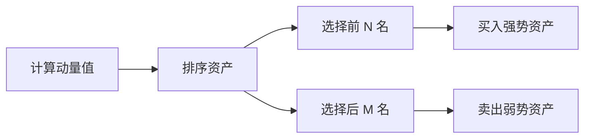

# 动量策略

动量策略（Momentum Strategy）基于"强者恒强"的理念，买入近期表现强势的资产，卖出表现弱势的资产。

## 📖 策略原理

### 核心思想

- **趋势延续**: 过去表现好的资产在未来一段时间内继续表现良好
- **动量效应**: 价格变动具有惯性，上涨的倾向于继续上涨

### 动量因子

```
动量值 = (当前价格 - N 日前价格) / N 日前价格
```

## 📊 策略图示



## 💻 代码实现

```python
from openfinagent import Strategy, Signal, SignalType
import numpy as np

class MomentumStrategy(Strategy):
    """
    动量策略
    
    参数:
        lookback_period: 动量计算周期 (默认：20)
        holding_period: 持仓周期 (默认：5)
        top_n: 选择前 N 只股票 (默认：5)
    """
    
    def __init__(self, lookback_period: int = 20, 
                 holding_period: int = 5,
                 top_n: int = 5):
        super().__init__(name="Momentum")
        self.lookback_period = lookback_period
        self.holding_period = holding_period
        self.top_n = top_n
        self.holding_days = 0
    
    def on_bar(self, bar):
        self.holding_days += 1
        
        # 未到调仓日，跳过
        if self.holding_days < self.holding_period:
            return
        
        # 重置持仓计数
        self.holding_days = 0
        
        # 获取所有标的的动量值
        momentum_scores = {}
        for symbol in self.get_symbols():
            closes = self.get_closes(symbol, self.lookback_period + 1)
            if len(closes) < self.lookback_period + 1:
                continue
            
            # 计算动量
            momentum = (closes[-1] - closes[0]) / closes[0]
            momentum_scores[symbol] = momentum
        
        # 排序
        sorted_symbols = sorted(
            momentum_scores.items(), 
            key=lambda x: x[1], 
            reverse=True
        )
        
        # 买入前 N 名
        for i in range(min(self.top_n, len(sorted_symbols))):
            symbol = sorted_symbols[i][0]
            if not self.has_position(symbol):
                self.emit_signal(Signal(
                    type=SignalType.BUY,
                    symbol=symbol,
                    strength=0.8,
                    reason=f"动量排名第{i+1}"
                ))
        
        # 卖出不在前 N 名的持仓
        for symbol in self.get_positions():
            if symbol not in [s[0] for s in sorted_symbols[:self.top_n]]:
                self.emit_signal(Signal(
                    type=SignalType.SELL,
                    symbol=symbol,
                    strength=1.0,
                    reason="跌出动量排名"
                ))
```

## ⚙️ 参数配置

```yaml
strategy:
  name: Momentum
  params:
    lookback_period: 20    # 动量计算周期
    holding_period: 5      # 持仓周期
    top_n: 5              # 持有数量
    rebalance_freq: 5     # 调仓频率
```

### 参数调优建议

| 参数 | 保守 | 平衡 | 激进 |
|------|------|------|------|
| lookback_period | 60 | 20 | 10 |
| holding_period | 10 | 5 | 3 |
| top_n | 3 | 5 | 10 |

## 📈 回测示例

```python
from openfinagent import Backtester, MomentumStrategy

# 创建策略
strategy = MomentumStrategy(
    lookback_period=20,
    holding_period=5,
    top_n=5
)

# 多股票回测
backtester = Backtester(
    strategy=strategy,
    data_files={
        'AAPL': 'data/aapl.csv',
        'GOOGL': 'data/googl.csv',
        'MSFT': 'data/msft.csv',
        'AMZN': 'data/amzn.csv',
        'TSLA': 'data/tsla.csv'
    },
    initial_capital=100000,
    commission=0.001
)

results = backtester.run()
print(results.summary())
```

## 🎯 优缺点分析

### 优点

- ✅ 捕捉强势股，收益潜力大
- ✅ 逻辑清晰，易于理解
- ✅ 适用于多资产组合
- ✅ 在趋势市场中表现优异

### 缺点

- ❌ 动量反转时损失较大
- ❌ 调仓频繁，交易成本高
- ❌ 需要较多标的选择
- ❌ 在市场转折点表现差

## 🔧 优化方向

### 1. 风险调整动量

```python
# 使用风险调整后的动量
def risk_adjusted_momentum(returns, volatility):
    return returns / (volatility + 1e-6)

# 计算每只股票的风险调整动量
for symbol in symbols:
    ret = self.get_return(symbol, lookback)
    vol = self.get_volatility(symbol, lookback)
    scores[symbol] = risk_adjusted_momentum(ret, vol)
```

### 2. 行业中性化

```python
# 按行业分组，每组选择动量最强的
for sector in sectors:
    sector_stocks = get_stocks_in_sector(sector)
    sector_momentum = calculate_momentum(sector_stocks)
    top_stock = select_top(sector_momentum, n=1)
    selected.append(top_stock)
```

### 3. 结合其他因子

```python
# 动量 + 价值 + 质量
final_score = (
    0.5 * momentum_score + 
    0.3 * value_score + 
    0.2 * quality_score
)
```

## 📊 适用场景

| 场景 | 适用性 | 说明 |
|------|--------|------|
| 股票市场 | ⭐⭐⭐⭐ | 适合多股票组合 |
| 期货市场 | ⭐⭐⭐⭐ | 跨品种动量 |
| 加密货币 | ⭐⭐⭐⭐⭐ | 动量效应明显 |
| 外汇市场 | ⭐⭐⭐ | 需要结合其他因素 |

## ⚠️ 风险提示

1. **动量反转**: 强势股可能突然反转
2. **拥挤交易**: 过多资金追逐相同标的
3. **流动性风险**: 小盘股可能难以进出
4. **市场风格切换**: 风格切换时表现差

## 📚 相关资源

- [策略文档索引](index.md)
- [多因子策略教程](../tutorials/)
- [风险管理 API](../api/risk.md)

---

_动量策略是量化对冲基金的经典策略之一。_
