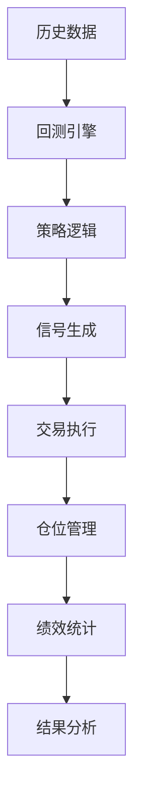

# 回测实战

本教程将深入学习回测系统，掌握策略优化和评估的方法。

## 🎯 学习目标

- 理解回测系统原理
- 掌握回测配置方法
- 学会策略优化技巧
- 正确评估策略表现

## 📊 回测系统架构



## 🔧 回测配置

### 基础配置

```python
from openfinagent import Backtester, Strategy

backtester = Backtester(
    strategy=strategy,
    data_file='data/stock_data.csv',
    
    # 资金配置
    initial_capital=100000,      # 初始资金
    
    # 交易成本
    commission=0.001,            # 手续费率
    slippage=0.001,              # 滑点
    
    # 时间范围
    start_date='2023-01-01',
    end_date='2023-12-31',
    
    # 其他配置
    benchmark='SPY',             # 基准
    risk_free_rate=0.02          # 无风险利率
)
```

### 高级配置

```python
backtester = Backtester(
    strategy=strategy,
    data_file='data/stock_data.csv',
    
    # 仓位管理
    max_position_size=0.3,       # 最大仓位比例
    max_daily_turnover=0.5,      # 最大日换手
    
    # 风控规则
    max_drawdown=0.2,            # 最大回撤
    daily_loss_limit=0.05,       # 单日亏损限制
    
    # 交易规则
    min_hold_period=1,           # 最小持仓周期
    trade_on_close=True,         # 收盘价成交
)
```

## 📈 运行回测

### 单次回测

```python
# 运行回测
results = backtester.run()

# 查看摘要
print(results.summary())
```

### 多次回测

```python
# 参数网格搜索
param_grid = {
    'short_window': [5, 10, 15],
    'long_window': [20, 30, 50]
}

best_sharpe = 0
best_params = None

for short in param_grid['short_window']:
    for long in param_grid['long_window']:
        strategy = MyStrategy(short_window=short, long_window=long)
        backtester = Backtester(strategy, data_file='data.csv')
        results = backtester.run()
        
        if results.sharpe_ratio > best_sharpe:
            best_sharpe = results.sharpe_ratio
            best_params = {'short': short, 'long': long}

print(f"最优参数：{best_params}")
print(f"最优夏普比率：{best_sharpe}")
```

## 📊 绩效指标

### 收益指标

```python
print(f"总收益率：{results.total_return:.2%}")
print(f"年化收益率：{results.annual_return:.2%}")
print(f"超额收益：{results.alpha:.2%}")
print(f"基准收益：{results.benchmark_return:.2%}")
```

### 风险指标

```python
print(f"最大回撤：{results.max_drawdown:.2%}")
print(f"波动率：{results.volatility:.2%}")
print(f"VaR(95%): {results.var_95:.2%}")
```

### 风险调整收益

```python
print(f"夏普比率：{results.sharpe_ratio:.2f}")
print(f"索提诺比率：{results.sortino_ratio:.2f}")
print(f"卡尔玛比率：{results.calmar_ratio:.2f}")
```

### 交易统计

```python
print(f"交易次数：{results.trade_count}")
print(f"胜率：{results.win_rate:.2%}")
print(f"盈亏比：{results.profit_factor:.2f}")
print(f"平均盈利：{results.avg_win:.2f}")
print(f"平均亏损：{results.avg_loss:.2f}")
```

## 📉 结果可视化

### 资金曲线

```python
# 绘制资金曲线
results.plot()

# 绘制累计收益
results.plot_cumulative_returns()

# 绘制回撤
results.plot_drawdown()
```

### 收益分布

```python
# 月度收益
results.plot_monthly_returns()

# 收益分布
results.plot_return_distribution()

# 滚动夏普
results.plot_rolling_sharpe()
```

### 对比分析

```python
# 对比基准
results.plot_vs_benchmark()

# 对比多个策略
results1 = backtester1.run()
results2 = backtester2.run()

compare_results([results1, results2])
```

## 🔍 策略优化

### 参数优化

```python
from openfinagent import ParameterOptimizer

optimizer = ParameterOptimizer(
    strategy_class=MyStrategy,
    data_file='data.csv',
    param_ranges={
        'window': range(10, 60, 5),
        'threshold': [0.01, 0.02, 0.03]
    },
    objective='sharpe_ratio'  # 优化目标
)

best_params, best_results = optimizer.optimize()
print(f"最优参数：{best_params}")
```

### 避免过拟合

```python
# 样本外测试
train_data = 'data/train.csv'
test_data = 'data/test.csv'

# 在训练集上优化
optimizer = ParameterOptimizer(..., data_file=train_data)
best_params, _ = optimizer.optimize()

# 在测试集上验证
strategy = MyStrategy(**best_params)
backtester = Backtester(strategy, data_file=test_data)
test_results = backtester.run()

print(f"样本外夏普比率：{test_results.sharpe_ratio}")
```

### 交叉验证

```python
from openfinagent import CrossValidator

cv = CrossValidator(
    strategy_class=MyStrategy,
    data_file='data.csv',
    n_splits=5,  # 5 折交叉验证
    params={'window': 20}
)

cv_results = cv.run()
print(f"平均夏普比率：{cv_results.mean_sharpe:.2f}")
print(f"标准差：{cv_results.std_sharpe:.2f}")
```

## ⚠️ 常见问题

### 未来函数

```python
# ❌ 错误：使用了未来数据
def on_bar(self, bar):
    if bar.close > self.get_high():  # get_high() 包含当天最高价
        self.buy()

# ✅ 正确：只使用历史数据
def on_bar(self, bar):
    if bar.close > self.get_high(count=20, end_index=-1):
        self.buy()
```

### 幸存者偏差

```python
# ❌ 错误：只使用当前存在的股票
stocks = get_current_stocks()

# ✅ 正确：使用历史某时点的股票列表
stocks = get_historical_stocks(date='2023-01-01')
```

### 流动性假设

```python
# ❌ 错误：假设 unlimited 流动性
self.buy(quantity=1000000)

# ✅ 正确：考虑成交量限制
max_buy = bar.volume * 0.1  # 不超过成交量 10%
self.buy(quantity=min(1000000, max_buy))
```

## 📚 下一步

- [实盘部署](live-trading.md) - 将策略部署到实盘
- [机器学习策略](../strategies/ml-strategy.md) - 学习高级策略

## ✅ 练习

1. 对双均线策略进行参数优化
2. 添加交易成本分析
3. 进行样本外测试
4. 绘制完整的绩效报告

---

_掌握回测是成为量化交易员的关键！_
