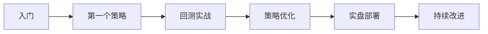

# 教程集合

本教程集合将带你从零开始学习 OpenFinAgent，逐步掌握量化交易的核心技能。

## 📚 教程列表

| 教程 | 难度 | 时长 | 描述 |
|------|------|------|------|
| [第一个策略](first-strategy.md) | ⭐⭐ | 30 分钟 | 创建你的第一个交易策略 |
| [回测实战](backtesting.md) | ⭐⭐⭐ | 60 分钟 | 学习回测和策略优化 |
| [实盘部署](live-trading.md) | ⭐⭐⭐⭐ | 90 分钟 | 部署策略到实盘交易 |

## 🎯 学习路径



## 📋 前置要求

- Python 3.9+ 基础
- 基本的量化交易概念
- 命令行操作基础

## 🛠️ 环境准备

```bash
# 安装 OpenFinAgent
pip install openfinagent

# 验证安装
python -c "import openfinagent; print(openfinagent.__version__)"

# 准备数据
python scripts/download_data.py
```

## 📖 学习建议

1. **循序渐进**: 按顺序完成每个教程
2. **动手实践**: 不要只看不做
3. **理解原理**: 理解代码背后的逻辑
4. **不断优化**: 尝试改进示例代码

## 🎓 进阶学习

完成基础教程后，可以学习：

- [机器学习策略](../strategies/ml-strategy.md)
- [深度学习策略](../strategies/deep-learning.md)
- [多因子模型](../advanced/multi-factor.md)
- [风险管理](../advanced/risk-management.md)

## 💬 获取帮助

遇到问题？

1. 查看 [FAQ](../faq.md)
2. 搜索 [GitHub Issues](https://github.com/bobipika2026/openfinagent/issues)
3. 参与 [社区讨论](https://github.com/bobipika2026/openfinagent/discussions)

---

_开始你的量化交易之旅！🚀_
