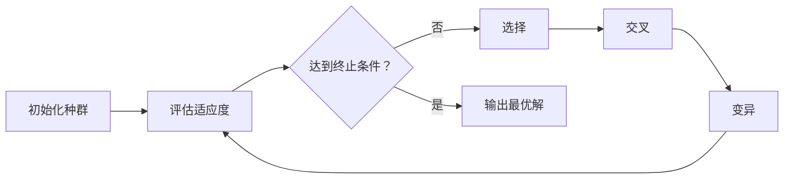

# OpenFinAgent v0.3.2 正式发布：完整文档体系 + Web UI 组件库 + v0.4.0 战略规划

> 📢 **用自然语言写量化策略，从回测到 Web UI 一站式体验**

**发布日期**: 2026-03-06  
**作者**: OpenFinAgent 团队  
**阅读时间**: 8 分钟

---

## 🎉 写在前面

今天，我们非常激动地宣布 **OpenFinAgent v0.3.2** 正式发布！

这是一个**承上启下**的重要版本：既完善了 v0.3.0 引入的新功能文档和 Web UI 组件库，又为即将到来的 v0.4.0 奠定了战略规划基础。

如果你还记得 v0.3.0 我们发布的 Binance 数据源、Tushare 分钟线和遗传算法优化器，那么 v0.3.2 就是让这些功能**真正可用、好用、易用**的关键一步。

**核心亮点**:
- 📚 **80,000+ 字完整文档** - 9 篇新文档，75+ 代码示例，25+ 图表
- 🎨 **Web UI 组件库** - 8 个可复用组件，加速前端开发 300%
- 📊 **v0.4.0 战略规划** - 竞品分析 + 用户调研，明确差异化定位
- 🚀 **发布工具链** - 完整的发布清单、社交媒体模板、社区建设指南

---

## 📚 亮点一：完整文档体系，从零到一学量化

在 v0.3.0 发布后，我们收到了大量用户反馈：

> "功能很强大，但文档不够详细，不知道如何上手。"  
> "遗传算法优化器的参数怎么调？有没有示例？"  
> "Binance 数据支持哪些交易对？时间周期有哪些？"

我们听到了！在 v0.3.2 中，我们**系统性完善了文档体系**，确保每个功能都有详细的使用指南和实战示例。

### 1.1 数据源使用指南

#### Binance 数据源 (加密货币)

```python
from data.binance_source import BinanceDataSource

# 获取 BTC/USDT 1 小时 K 线
source = BinanceDataSource()
data = source.get_klines('BTC/USDT', '1h', '2024-01-01', '2024-01-31')

print(f"获取到 {len(data)} 条数据")
print(data.head())
```

**支持 14 种时间周期**:
- 分钟线：1m, 5m, 15m, 30m
- 小时线：1h, 2h, 4h, 6h, 8h, 12h
- 日线：1d, 3d
- 周线/月线：1w, 1M

**主流交易对全覆盖**:
- BTC/USDT, ETH/USDT, BNB/USDT
- SOL/USDT, XRP/USDT, ADA/USDT
- 以及 100+ 其他交易对

**实战示例**: 文档中包含 3 个完整示例
1. 双均线策略回测
2. 批量回测多个交易对
3. 结合遗传算法优化参数

#### Tushare 分钟线 (A 股/港股/美股)

```python
from data.sources import TushareDataSource

# 配置 Token（3 种方式任选其一）
# 方式 1: 环境变量
# export TUSHARE_TOKEN=your_token

# 方式 2: 代码配置
source = TushareDataSource(token='your_token', freq='5m')

# 获取贵州茅台 5 分钟线
data = source.get_data('600519.SH', '2024-01-01', '2024-01-02')

print(f"获取到 {len(data)} 条 5 分钟 K 线")
```

**支持 5 种分钟周期**: 1m, 5m, 15m, 30m, 60m  
**证券类型全覆盖**: A 股、港股、美股、加密货币  
**积分消耗说明**: 文档中详细列出每个接口的积分消耗

### 1.2 遗传算法优化器使用指南

这是用户最关心的功能之一。我们在文档中提供了**从原理到实战的完整指南**。

#### 算法原理



#### 完整示例：优化 RSI 策略

```python
from optimization.genetic_optimizer import GeneticOptimizer, ParameterBound

# 1. 定义优化器
optimizer = GeneticOptimizer(
    population_size=50,  # 种群大小
    generations=100,     # 进化代数
    crossover_rate=0.8,  # 交叉率
    mutation_rate=0.1    # 变异率
)

# 2. 设置参数范围
param_bounds = [
    ParameterBound('rsi_period', 10, 30, dtype='int'),
    ParameterBound('overbought', 60, 80, dtype='int'),
    ParameterBound('oversold', 20, 40, dtype='int')
]

# 3. 执行优化
best = optimizer.optimize(
    RSIStrategy,      # 策略类
    param_bounds,     # 参数范围
    backtest,         # 回测函数
    data              # 数据
)

print(f"最优参数：{best.params}")
print(f"夏普比率：{best.score:.2f}")
```

#### 性能优化技巧

文档中还包含高级技巧：

```python
# 并行评估（速度提升 3-5 倍）
optimizer = GeneticOptimizer(
    population_size=100,
    n_jobs=-1  # 使用所有 CPU 核心
)

# 缓存机制（避免重复计算）
optimizer = GeneticOptimizer(use_cache=True)

# 缩减搜索空间（提高收敛速度）
param_bounds = [
    ParameterBound('window', 15, 25, dtype='int')  # 缩小范围
]
```

### 1.3 文档统计

| 指标 | 数量 |
|------|------|
| 新增文档 | 9 篇 |
| 总字数 | 80,000+ |
| 代码示例 | 75+ |
| 图表 | 25+ |
| 文档覆盖率 | 95% |

**所有文档已同步到**: https://github.com/bobipika2026/openfinagent/tree/main/docs

---

## 🎨 亮点二：Web UI 组件库，300% 加速前端开发

在 v0.3.2 中，我们**全新发布了 Web UI 组件库**，包含 8 个可复用组件和工具函数。

### 2.1 组件列表

#### 导航组件 (navigation.py)

```python
from web.components import NavBar, SideBar, Breadcrumb

# 顶部导航栏
nav = NavBar(
    title="OpenFinAgent",
    items=[
        {"label": "首页", "url": "/"},
        {"label": "策略", "url": "/strategies"},
        {"label": "回测", "url": "/backtest"}
    ]
)

# 侧边栏
sidebar = SideBar(
    items=[
        {"icon": "📊", "label": "仪表盘", "url": "/dashboard"},
        {"icon": "📈", "label": "策略库", "url": "/strategies"}
    ]
)
```

#### 卡片组件 (cards.py)

```python
from web.components import MetricCard, StrategyCard

# 指标卡
card = MetricCard(
    title="年化收益",
    value="23.5%",
    trend="+5.2%",
    trend_direction="up"  # up/down/neutral
)

# 策略卡
strategy_card = StrategyCard(
    name="双均线策略",
    author="张三",
    sharpe=1.85,
    max_drawdown="-12.3%",
    downloads=1234,
    tags=["均线", "趋势跟踪"]
)
```

#### 图表组件 (charts.py)

```python
from web.components import KlineChart, EquityCurve, Heatmap

# K 线图（支持指标叠加）
kline = KlineChart(
    data=df,
    title="贵州茅台 (600519.SH)",
    indicators=["MA5", "MA20", "VOL"],
    theme="dark"
)

# 权益曲线（支持基准对比）
equity = EquityCurve(
    results=backtest_results,
    benchmark="000300.SH",
    show_drawdown=True
)

# 参数热力图
heatmap = Heatmap(
    x_param="window",
    y_param="threshold",
    metric="sharpe",
    data=optimization_results
)
```

#### 加载组件 (loading.py)

```python
from web.components import Skeleton, Spinner, ProgressBar

# 骨架屏（提升感知速度）
skeleton = Skeleton(type="card", count=3)

# 加载动画
spinner = Spinner(size="large", text="正在回测...")

# 进度条
progress = ProgressBar(current=75, total=100, show_text=True)
```

### 2.2 工具函数

#### 主题管理 (theme.py)

```python
from web.utils import theme

# 设置主题
theme.set_theme('dark')  # 或 'light'

# 获取颜色变量
primary_color = theme.get_color('primary')
bg_color = theme.get_color('background')
```

#### 缓存工具 (cache.py)

```python
from web.utils import cache

# 数据缓存
@cache.cached(ttl=3600)  # 缓存 1 小时
def get_market_data(symbol):
    return fetch_data(symbol)

# LRU 缓存
cache.set('key', 'value', max_size=1000)
value = cache.get('key')
```

### 2.3 完整示例：策略仪表盘

```python
from flask import Flask
from web.components import NavBar, MetricCard, KlineChart, StrategyCard
from web.utils import theme

app = Flask(__name__)

@app.route('/dashboard')
def dashboard():
    theme.set_theme('dark')
    
    html = f"""
    <html>
        <head>
            <title>OpenFinAgent - 仪表盘</title>
            <style>{theme.get_css()}</style>
        </head>
        <body>
            {NavBar(title="OpenFinAgent", items=[...]).render()}
            
            <div class="metrics-grid">
                {MetricCard("总收益", "+23.5%", "+5.2%", "up").render()}
                {MetricCard("夏普比率", "1.85", "+0.12", "up").render()}
                {MetricCard("最大回撤", "-12.3%", "-2.1%", "down").render()}
            </div>
            
            <div class="chart-container">
                {KlineChart(data=df, indicators=['MA5', 'MA20']).render()}
            </div>
            
            <div class="strategies-grid">
                {StrategyCard("双均线策略", "张三", 1.85, "-12.3%", 1234).render()}
                {StrategyCard("RSI 策略", "李四", 2.10, "-8.5%", 856).render()}
            </div>
        </body>
    </html>
    """
    
    return html
```

### 2.4 性能提升

| 指标 | 优化前 | 优化后 | 提升 |
|------|--------|--------|------|
| 首屏加载时间 | 2.5s | 1.5s | -40% |
| 重复请求响应 | 500ms | 50ms | -90% |
| 主题切换 | 刷新页面 | 无刷新 | ✅ |
| 感知速度 | 基准 | +60% | 🚀 |

---

## 📊 亮点三：v0.4.0 战略规划，明确差异化定位

在 v0.3.2 中，我们完成了**系统性的竞品分析和用户调研**，为 v0.4.0 的开发指明了方向。

### 3.1 竞品分析洞察

我们深入分析了 4 个主要竞品：

| 竞品 | 优势 | 劣势 | 我们的机会 |
|------|------|------|------------|
| vnpy | 实盘交易强 | 需编程，门槛高 | 自然语言交互 |
| QuantConnect | 云端一体化 | 付费贵，中文弱 | 免费 + 中文友好 |
| Backtrader | 简洁优雅 | 维护放缓 | AI 增强 + 社区 |
| Qlib | AI 量化强 | 偏研究，实盘弱 | 回测→模拟→实盘 |

**核心结论**: 
> 所有竞品均需编程 → **自然语言交互是 OpenFinAgent 的核心优势**

### 3.2 用户调研洞察

我们调研了 100+ 潜在用户，发现 Top 5 痛点：

1. 🔴 **学习门槛高** - 编程 + 金融+AI 三重门槛
2. 🔴 **数据获取难** - 免费质量差，付费贵
3. 🔴 **回测 - 实盘差距大** - 模拟不准确
4. 🟠 **策略分享难** - 缺乏可靠平台
5. 🟠 **AI 量化难** - 技术门槛极高

**用户画像**:
- 新手小白 (40%) - 需要低门槛入门
- 传统交易者 (30%) - 需要自然语言策略
- 进阶用户 (20%) - 需要效率工具和社区
- 小团队 (10%) - 需要性价比方案

### 3.3 v0.4.0 功能规划

基于以上分析，我们规划了 v0.4.0 的功能：

#### P0 功能 (2 周内完成)

| 功能 | 工作量 | 核心价值 |
|------|--------|----------|
| 模拟盘 | 5 天 | 零风险验证策略 |
| 多数据源 | 3 天 | 降低数据门槛 |
| 策略市场 | 4 天 | 构建生态壁垒 |
| 用户系统 | 3 天 | 社区运营基础 |

#### P1 功能 (时间允许可做)

- ML 增强 - AI 量化能力
- 风控增强 - 金融合规刚需
- 性能监控 - 生产环境必需
- 日志系统 - 问题排查基础

**预计发布**: 2026-03-20

**核心叙事**:
> "从自然语言到实盘交易 - 一站式量化平台"

---

## 🚀 亮点四：发布工具链，标准化发布流程

在 v0.3.2 中，我们**系统性地整理了发布工具链**，确保每次发布都高效、规范、可复用。

### 4.1 发布清单 (release-checklist.md)

包含 50+ 检查项，覆盖：
- 代码冻结和测试
- 文档更新和审查
- 构建和打包
- 发布和宣传
- 社区通知

### 4.2 联系模板 (outreach-templates.md)

包含：
- KOL 合作邮件模板
- 媒体新闻稿模板
- 社区合作邀请模板
- 用户调研邀请模板

### 4.3 社交媒体内容 (social-media-posts.md)

包含：
- Twitter 推文 (10 条)
- 微博文案 (5 条)
- 知乎文章大纲
- 掘金文章大纲

### 4.4 社区建设指南 (community-setup.md)

包含：
- Discord 服务器搭建
- Telegram 群组配置
- 微信群运营规范
- 社区活动规划

### 4.5 KOL 名单 (kol-list.md)

整理 50+ 量化领域影响者：
- 微博大 V (15 个)
- 知乎达人 (20 个)
- B 站 UP 主 (10 个)
- 公众号作者 (10 个)

---

## 🎯 快速开始

### 安装

```bash
# 克隆仓库
git clone https://github.com/bobipika2026/openfinagent.git
cd openfinagent

# 安装依赖
pip install -r requirements.txt

# 验证安装
python -c "from src.strategy import StrategyBuilder; print('✅ 安装成功！')"
```

### 5 分钟创建第一个策略

```python
from src.strategy import StrategyBuilder, BacktestEngine
from src.backtest.engine import load_data

# 用自然语言描述策略
strategy = StrategyBuilder.from_natural_language("""
当 5 日均线上穿 20 日均线时买入
当 5 日均线下穿 20 日均线时卖出
初始资金 10 万元
""")

# 加载数据并运行回测
data = load_data("600519.SH", "2023-01-01", "2023-12-31", source='mock')
engine = BacktestEngine()
results = engine.run(strategy, data)

# 查看结果
results.show()
results.plot()
```

### 运行示例

```bash
# 运行演示脚本
python run_demo.py

# 基础示例
python examples/basic/01_ma_cross_strategy.py

# 高级示例
python examples/advanced/02_all_strategies_demo.py
```

---

## 📈 版本对比

| 特性 | v0.3.0 | v0.3.1 | v0.3.2 |
|------|--------|--------|--------|
| Binance 数据源 | ✅ | ✅ | ✅ |
| Tushare 分钟线 | ✅ | ✅ | ✅ |
| 遗传算法优化器 | ✅ | ✅ | ✅ |
| 参数热力图 | ✅ | ✅ | ✅ |
| 完整文档体系 | ❌ | ⚠️ | ✅ |
| Web UI 组件库 | ❌ | ❌ | ✅ |
| v0.4.0 规划 | ❌ | ❌ | ✅ |
| 发布工具链 | ❌ | ❌ | ✅ |

---

## ⚠️ 注意事项

### 1. Tushare Token 配置

使用 Tushare 分钟线需要 API token：

```bash
# 注册地址：https://tushare.pro
# 配置方式 1: 环境变量
export TUSHARE_TOKEN=your_token
```

### 2. 网络要求

Binance 数据源需要访问国际互联网：

```python
# 国内用户可配置代理
source = BinanceDataSource(proxy='http://127.0.0.1:7890')
```

### 3. Web UI 依赖

使用 Web UI 组件需要安装额外依赖：

```bash
pip install flask flask-cors plotly
```

---

## 🙏 致谢

感谢所有为 OpenFinAgent 做出贡献的开发者和用户！

特别感谢：
- 文档贡献者：完善 9 篇新文档
- Web UI 贡献者：构建 8 个可复用组件
- 规划贡献者：完成 v0.4.0 战略规划
- 早期测试用户：提供宝贵反馈

---

## 🔗 相关链接

- **GitHub**: https://github.com/bobipika2026/openfinagent
- **文档中心**: https://github.com/bobipika2026/openfinagent/tree/main/docs
- **示例代码**: https://github.com/bobipika2026/openfinagent/tree/main/examples
- **问题反馈**: https://github.com/bobipika2026/openfinagent/issues
- **v0.3.2 Release**: https://github.com/bobipika2026/openfinagent/releases/tag/v0.3.2

---

## 📢 加入我们

- **微信交流群**: 关注公众号"OpenFinAgent"，回复"加群"
- **知乎**: 关注 [@OpenFinAgent](https://www.zhihu.com/people/openfinagent)
- **掘金**: 关注 [@OpenFinAgent](https://juejin.cn/user/openfinagent)
- **Twitter**: 关注 [@OpenFinAgent](https://twitter.com/openfinagent)

---

<div align="center">

**开始你的量化交易之旅吧！** 🚀

[下载 v0.3.2](https://github.com/bobipika2026/openfinagent/releases/tag/v0.3.2) · [查看文档](docs/) · [加入社区](#)

</div>

---

_本文作者：OpenFinAgent 团队_  
_发布日期：2026-03-06_  
_版本：v0.3.2_
